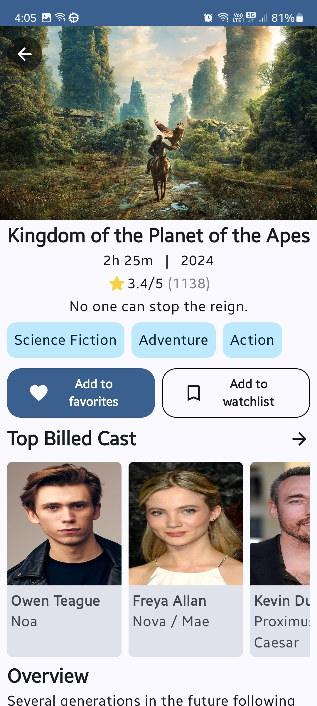
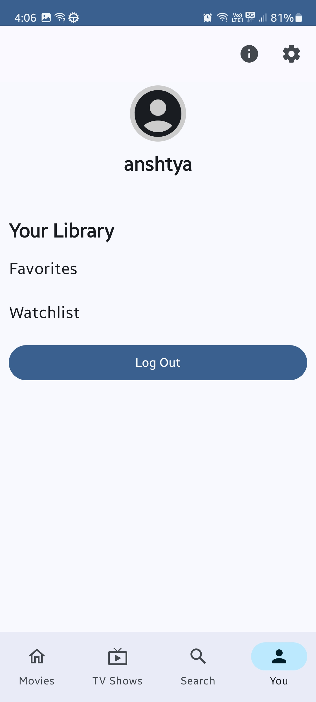

# Movies And Beyond

<p align="center">
  
</p>

<p align="center">
  <a href="https://github.com/keisardev/moviesandbeyond/releases/latest">
    
  </a>
  <a href="https://github.com/keisardev/moviesandbeyond/actions/workflows/build.yml">
    
  </a>
</p>

A modern Android application that provides comprehensive information about movies, TV shows, and people from The Movie Database (TMDB). Built with the latest Android development best practices, this app showcases clean architecture, multi-module design, and beautiful Material Design 3 UI.

## 📸 Screenshots

<p align="center">
  
  
  
  
</p>

<p align="center">
  
  
  
</p>

## ✨ Features

- **Discover Content**: Browse popular and trending movies and TV shows with beautiful card-based layouts
- **Advanced Search**: Multi-search functionality to find movies, TV shows, and people
- **Detailed Information**: View comprehensive details including cast, crew, ratings, and production information
- **TMDB Account Integration**: Connect your TMDB account to access and manage your personal watchlists and favorites
- **Personal Library**: Keep track of your favorite content and watchlist items
- **Modern UI/UX**: Beautiful Material Design 3 interface with frosted glass effects and smooth animations
- **Offline Support**: Local caching for seamless browsing experience

## 🏗️ Architecture

This project implements a **multi-module architecture** following official [Android modularization patterns](https://developer.android.com/topic/modularization/patterns), combining both feature-based and layer-based approaches for maximum scalability and maintainability.

### Architecture Highlights

- **Clean Architecture**: Clear separation of concerns with data, domain, and presentation layers
- **Unidirectional Data Flow**: Predictable state management with ViewModel and StateFlow
- **Repository Pattern**: Abstracted data sources for flexibility and testability
- **Dependency Injection**: Hilt/Dagger for compile-time safe dependency injection
- **Reactive Programming**: Kotlin Coroutines and Flow for asynchronous operations

### Module Structure

```
├── app                 # Application entry point, navigation, theme
├── core
│   ├── local          # Room database, DataStore, SharedPreferences
│   ├── model          # Shared domain models
│   ├── network        # Retrofit/Ktor API clients
│   ├── testing        # Testing utilities
│   └── ui             # Reusable UI components
├── data               # Repository implementations and data layer
├── feature
│   ├── auth           # TMDB authentication
│   ├── details        # Content details screens
│   ├── movies         # Movies feed and listings
│   ├── search         # Search functionality
│   ├── tv             # TV shows feed and listings
│   └── you            # User profile and library
├── sync               # Background synchronization
└── build-logic        # Custom Gradle convention plugins
```

### Store5 Offline-First Architecture

This app implements a robust **offline-first architecture** using [Store5](https://github.com/MobileNativeFoundation/Store) from Mobile Native Foundation. Store5 provides a unified caching layer that seamlessly handles network requests, local persistence, and memory caching.

#### Data Flow Diagram

```
┌─────────────────────────────────────────────────────────────────────────┐
│                              UI Layer                                    │
│                    (Compose + ViewModel)                                 │
└──────────────────────────────┬──────────────────────────────────────────┘
                               │
                               ▼
┌─────────────────────────────────────────────────────────────────────────┐
│                         Repository Layer                                 │
│              observeMovieItems() / observeTvShowItems()                 │
└──────────────────────────────┬──────────────────────────────────────────┘
                               │
                               ▼
┌─────────────────────────────────────────────────────────────────────────┐
│                           Store5 Layer                                   │
│  ┌─────────────────────────────────────────────────────────────────┐   │
│  │                      Memory Cache                                │   │
│  │                  (100 items, LRU eviction)                       │   │
│  └──────────────────────────┬──────────────────────────────────────┘   │
│                             │ miss                                      │
│                             ▼                                           │
│  ┌─────────────────────────────────────────────────────────────────┐   │
│  │                   Source of Truth (Room)                         │   │
│  │              CachedContentDao / CachedContentEntity              │   │
│  └──────────────────────────┬──────────────────────────────────────┘   │
│                             │ miss                                      │
│                             ▼                                           │
│  ┌─────────────────────────────────────────────────────────────────┐   │
│  │                      Fetcher (Network)                           │   │
│  │                  TMDB API via Retrofit                           │   │
│  └─────────────────────────────────────────────────────────────────┘   │
└─────────────────────────────────────────────────────────────────────────┘
```

#### Caching Strategy

| Cache Layer | Purpose | Configuration |
|-------------|---------|---------------|
| **Memory Cache** | Instant access for hot data | LRU with 100 items max |
| **Source of Truth (Room)** | Persistent offline storage | Survives app restarts |
| **Fetcher (Network)** | Fresh data from TMDB API | Only on cache miss or refresh |

**How it works:**

1. **Read Request**: When the UI requests data, Store5 first checks memory cache, then Room database, and finally fetches from network if needed.

2. **Automatic Persistence**: Network responses are automatically persisted to Room, ensuring offline availability.

3. **Stream-based API**: Returns a `Flow<StoreReadResponse>` that emits loading states, cached data, and fresh data progressively.

4. **Refresh Support**: Supports both cached reads (`StoreReadRequest.cached()`) and forced refresh (`StoreReadRequest.fresh()`).

```kotlin
// Example: Observing movie items with offline-first support
viewModel.observeMovieItems(MovieListCategory.POPULAR, page = 1)
    .collect { response ->
        when (response) {
            is StoreReadResponse.Loading -> showLoading()
            is StoreReadResponse.Data -> showContent(response.value)
            is StoreReadResponse.Error -> showError(response.error)
        }
    }
```

## 🛠️ Tech Stack

- **Language**: [Kotlin 2.3.0](https://kotlinlang.org/)
- **UI Framework**: [Jetpack Compose](https://developer.android.com/jetpack/compose) with Material Design 3
- **Dependency Injection**: [Hilt](https://dagger.dev/hilt/) 2.57.2
- **Networking**:
  - [Retrofit](https://square.github.io/retrofit/) 3.0.0 with Moshi converter
  - [Ktor](https://ktor.io/) 3.3.3 client
- **Local Storage**:
  - [Room](https://developer.android.com/training/data-storage/room) 2.8.4
  - [DataStore](https://developer.android.com/topic/libraries/architecture/datastore) 1.2.0 with Proto
- **Offline-First Caching**: [Store5](https://github.com/MobileNativeFoundation/Store) for unified caching layer
- **Image Loading**: [Coil](https://coil-kt.github.io/coil/) 2.7.0
- **Background Processing**: [WorkManager](https://developer.android.com/topic/libraries/architecture/workmanager) 2.11.0
- **Navigation**: [Navigation Compose](https://developer.android.com/jetpack/compose/navigation) 2.9.6
- **UI Effects**: [Haze](https://github.com/chrisbanes/haze) 1.7.1 for blur effects
- **Build System**: Gradle with Kotlin DSL and custom convention plugins
- **Code Quality**:
  - [Spotless](https://github.com/diffplug/spotless) 7.0.3 with [ktfmt](https://github.com/facebook/ktfmt) 0.51 for code formatting
  - [Detekt](https://detekt.dev/) 1.23.8 for static analysis

## 🚀 Getting Started

### Prerequisites

- **Android Studio**: Ladybug (2025.1.1) or later
- **JDK**: 17 or higher
- **Android SDK**: API 36 (compile) / Minimum SDK as configured
- **TMDB Account**: Required for API access

### Installation

1. **Clone the repository**
   ```bash
   git clone https://github.com/keisardev/moviesandbeyond.git
   cd moviesandbeyond
   ```

2. **Get your TMDB API Access Token**

   You need a TMDB API access token to use this app:

   - Visit [The Movie Database](https://www.themoviedb.org/)
   - Create a free account or log in
   - Go to [API Settings](https://www.themoviedb.org/settings/api)
   - Request an API key (choose "Developer" option)
   - Copy your **API Read Access Token** (v4 auth)

   > **⚠️ Important**: Never commit your API token to version control. The `local.properties` file is already included in `.gitignore` to protect your credentials.

3. **Configure API credentials**

   Create a `local.properties` file in the project root directory:
   ```properties
   ACCESS_TOKEN=your_tmdb_access_token_here
   BASE_URL=https://api.themoviedb.org/3/
   ```

   Replace `your_tmdb_access_token_here` with your actual TMDB API Read Access Token.

4. **Sync and build the project**

   Open the project in Android Studio and let Gradle sync. The project will automatically configure itself using the provided credentials.

5. **Run the app**

   Select a device or emulator and click the Run button, or use:
   ```bash
   ./gradlew assembleDebug
   ./gradlew installDebug
   ```

## 🧪 Testing

The project includes both unit tests and instrumentation tests:

### Run Unit Tests
```bash
# Run all unit tests
./gradlew test

# Run tests for a specific module
./gradlew :data:test
./gradlew :feature:movies:test
```

### Run Instrumentation Tests
```bash
# Run on connected device/emulator
./gradlew connectedAndroidTest

# Run debug variant tests only
./gradlew connectedDebugAndroidTest
```

### Code Quality

The project uses **Spotless** with **ktfmt** for code formatting and **Detekt** for static analysis.

```bash
# Check code formatting (Spotless)
./gradlew spotlessCheck

# Auto-format code with ktfmt
./gradlew spotlessApply

# Run static analysis (Detekt)
./gradlew detekt

# Run Android lint checks
./gradlew lint

# Run lint and apply safe fixes
./gradlew lintFix

# Run all checks (tests + lint + detekt)
./gradlew check
```

**Code Quality Reports:**
- Detekt reports: `build/reports/detekt/`
- Lint reports: `app/build/reports/lint/`

**CI/CD Integration:**
Code quality checks run automatically on every push and pull request via GitHub Actions:
1. ✅ Spotless formatting check
2. ✅ Detekt static analysis
3. ✅ Build and unit tests
4. ✅ Android instrumentation tests

## 📦 Building

### Debug Build
```bash
./gradlew assembleDebug
```
Output: `app/build/outputs/apk/debug/app-debug.apk`

### Release Build
```bash
./gradlew assembleRelease
```
Output: `app/build/outputs/apk/release/app-release.apk`

> **Note**: Release builds are configured with ProGuard/R8 for code shrinking and obfuscation.

## 🤝 Contributing

Contributions are welcome! If you'd like to contribute:

1. Fork the repository
2. Create a feature branch (`git checkout -b feature/amazing-feature`)
3. Commit your changes (`git commit -m 'Add some amazing feature'`)
4. Push to the branch (`git push origin feature/amazing-feature`)
5. Open a Pull Request

### Development Guidelines

- Follow [Kotlin coding conventions](https://kotlinlang.org/docs/coding-conventions.html)
- Code is automatically formatted with **ktfmt** (Google style) via Spotless
- Run `./gradlew spotlessApply` before committing to auto-format code
- Run `./gradlew detekt` to check for code smells and potential bugs
- Write unit tests for new features
- Ensure all tests pass before submitting PR: `./gradlew check`
- Keep commits atomic and well-documented

## 📄 License & Disclaimer

This project is an independent application and is not affiliated with, endorsed, or certified by The Movie Database (TMDB).

**API Usage**: This product uses the TMDB API but is not endorsed or certified by TMDB. All movie and TV show data is provided by [The Movie Database](https://www.themoviedb.org/).

**Logo**: The TMDB logo is a trademark of The Movie Database and is used for attribution purposes only.

## 🔗 Links

- [TMDB API Documentation](https://developer.themoviedb.org/docs)
- [Android Developers](https://developer.android.com/)
- [Jetpack Compose](https://developer.android.com/jetpack/compose)

## 👨‍💻 Author

**Keisardev**

- GitHub: [@keisardev](https://github.com/keisardev)

---

<p align="center">Made with ❤️ using Kotlin and Jetpack Compose</p>
