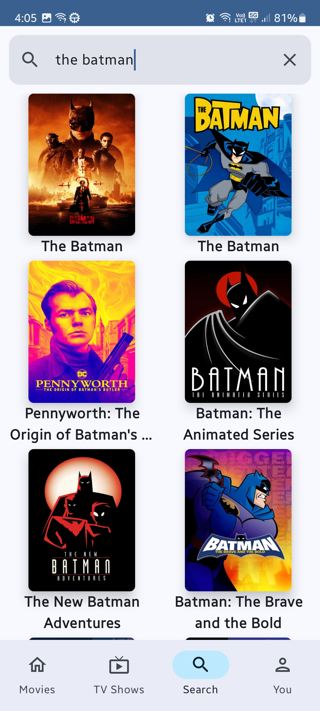

# MoviesAndBeyond

[](https://github.com/shaharKeisarApps/MoviesAndBeyond/releases/latest)
[](https://github.com/shaharKeisarApps/MoviesAndBeyond/actions/workflows/build.yml)

<p align="center">
  
</p>

A TMDB-powered movie & TV browser — and my personal playground for exploring cutting-edge Android technologies. Every library, pattern, and architecture decision here is chosen because I wanted to learn it hands-on.

## Screenshots

<p align="center">
  
  
  
  
</p>

<p align="center">
  
  
  
</p>

## What This Project Explores

This isn't just a TMDB client — it's a learning lab. Here's what I'm experimenting with:

**Architecture & Build**
- Multi-module architecture with custom Gradle convention plugins
- Clean Architecture with unidirectional data flow (ViewModel + StateFlow)
- Repository pattern with interface-based abstraction and test doubles

**UI / UX**
- Jetpack Compose with Material Design 3
- Haze frosted-glass blur effects on the navigation bar
- Material Kolor for dynamic seed-color theming
- HSV color picker for custom theme colors
- Edge-to-edge design with system bar handling

**Data & Networking**
- Dual networking stack: Retrofit 3.0 + Ktor 3.3 side by side
- Store5 for offline-first caching with Fetcher + SourceOfTruth
- Room database + DataStore (Proto) for local persistence
- WorkManager for background sync

**Testing & Quality**
- Compose Preview Screenshot Testing (alpha)
- Baseline Profiles + Macrobenchmarks
- Spotless (ktfmt) + Detekt for formatting & static analysis
- CI pipeline with GitHub Actions (quality gate + build + tests)

**Experimental / Alpha**
- Navigation 3 — developer-owned back stack (1.0.0)
- Store5 alpha — offline-first caching (5.1.0-alpha03)
- Compose Screenshot Testing (0.0.1-alpha12)

## Features

- Browse trending and popular movies & TV shows
- Multi-search across movies, TV shows, and people
- Rich detail screens with cast, crew, ratings, and metadata
- TMDB account integration for watchlists and favorites
- Customizable Material 3 theming with dynamic colors
- Offline support via Store5 caching
- Background sync with WorkManager

## Architecture

Multi-module design following [Android modularization patterns](https://developer.android.com/topic/modularization/patterns):

```
app                     Application entry, navigation, theme
core/
  local                 Room, DataStore, SharedPreferences
  model                 Shared domain models
  network               Retrofit + Ktor API clients
  testing               Test utilities (MainDispatcherRule)
  ui                    Reusable Compose components
data/                   Repository implementations + test doubles
feature/
  auth                  TMDB authentication
  details               Movie/TV/Person detail screens
  movies                Movies feed
  search                Multi-search
  tv                    TV shows feed
  you                   Profile & library
sync/                   Background sync (WorkManager)
build-logic/            Custom Gradle convention plugins
```

**Data flow**: Network (TMDB API) &rarr; Repository &rarr; ViewModel &rarr; Compose UI

## Tech Stack

| Category | Library | Version |
|----------|---------|---------|
| Language | [Kotlin](https://kotlinlang.org/) | 2.2.21 |
| UI | [Jetpack Compose](https://developer.android.com/jetpack/compose) (BOM) | 2025.12.01 |
| DI | [Hilt](https://dagger.dev/hilt/) | 2.57.2 |
| Networking | [Retrofit](https://square.github.io/retrofit/) + [Ktor](https://ktor.io/) | 3.0.0 / 3.3.3 |
| Caching | [Store5](https://github.com/MobileNativeFoundation/Store) | 5.1.0-alpha03 |
| Database | [Room](https://developer.android.com/training/data-storage/room) | 2.8.4 |
| Preferences | [DataStore](https://developer.android.com/topic/libraries/architecture/datastore) (Proto) | 1.2.0 |
| Image Loading | [Landscapist](https://github.com/skydoves/landscapist) | 2.8.2 |
| Navigation | [Navigation Compose](https://developer.android.com/jetpack/compose/navigation) + [Navigation 3](https://developer.android.com/develop/ui/compose/navigation#navigation3) | 2.9.6 / 1.0.0 |
| Blur Effects | [Haze](https://github.com/chrisbanes/haze) | 1.7.1 |
| Theming | [Material Kolor](https://github.com/jordond/materialkolor) | 4.0.0 |
| Color Picker | [colorpicker-compose](https://github.com/skydoves/colorpicker-compose) | 1.1.2 |
| Background Work | [WorkManager](https://developer.android.com/topic/libraries/architecture/workmanager) | 2.11.0 |
| Serialization | [Kotlin Serialization](https://github.com/Kotlin/kotlinx.serialization) | 1.9.0 |
| Benchmarks | [Macrobenchmark](https://developer.android.com/topic/performance/benchmarking/macrobenchmark-overview) | 1.3.3 |
| Screenshot Tests | [Compose Screenshot Testing](https://developer.android.com/studio/preview/compose-screenshot-testing) | 0.0.1-alpha12 |
| Formatting | [Spotless](https://github.com/diffplug/spotless) + [ktfmt](https://github.com/facebook/ktfmt) | 8.1.0 / 0.51 |
| Static Analysis | [Detekt](https://detekt.dev/) | 1.23.8 |
| Build | Gradle with Kotlin DSL + convention plugins | AGP 8.13.2 |

## Getting Started

### Prerequisites

- Android Studio Ladybug (2025.1.1) or later
- JDK 17+
- A free [TMDB account](https://www.themoviedb.org/) for API access

### Setup

1. Clone the repo
   ```bash
   git clone https://github.com/shaharKeisarApps/MoviesAndBeyond.git
   cd MoviesAndBeyond
   ```

2. Create `local.properties` in the project root with your TMDB credentials:
   ```properties
   ACCESS_TOKEN=your_tmdb_read_access_token
   BASE_URL=https://api.themoviedb.org/3/
   ```
   Get your token from [TMDB API Settings](https://www.themoviedb.org/settings/api) (choose "Developer", copy the **Read Access Token v4**).

3. Open in Android Studio, sync Gradle, and run.

## Code Quality & CI

The project enforces code quality on every push via [GitHub Actions](.github/workflows/build.yml):

1. **Code Quality Gate** — Spotless formatting + Detekt static analysis
2. **Build & Test** — `assembleDebug` + lint + unit tests
3. **Screenshot Tests** — Compose Preview screenshot validation
4. **Android Tests** — Instrumentation tests on emulator

```bash
# Run the full quality suite locally
./gradlew spotlessCheck detekt lintDebug test
```

## License & Attribution

This product uses the [TMDB API](https://developer.themoviedb.org/docs) but is not endorsed or certified by TMDB. All movie and TV show data is provided by [The Movie Database](https://www.themoviedb.org/). The TMDB logo is a trademark of The Movie Database and is used for attribution purposes only.

## Author

**Shahar Keisar**

- GitHub: [@shaharKeisarApps](https://github.com/shaharKeisarApps)

---

<p align="center">Built with Kotlin and Jetpack Compose</p>
